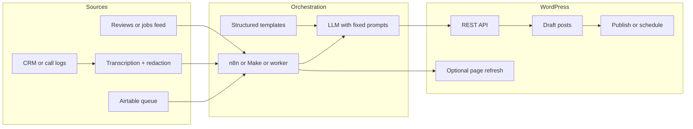

# Content automation pipeline (future plan)

Living design doc—not implemented in theme code. Describes how sites could stay fresh via Airtable (or similar), sanitized customer signals, and WordPress, with editorial guardrails.

**See also:** [../FUTURE_IDEAS.md](../FUTURE_IDEAS.md)

---

## 1. Goals and non-goals

**Goals**

- Steady stream of **on-brand, useful** content (mostly blog + selective page refreshes).
- **Single editorial queue** (visible, assignable, auditable)—usually Airtable.
- Automation that **reduces grunt work**, not accountability: drafts by default; auto-publish only where policy allows.

**Non-goals (initially)**

- Publishing **raw transcripts** or anything with **recoverable PII**.
- Unbounded autopilot without **duplicate-topic controls** and **quality gates**.

---

## 2. Reference architecture

**Principle:** Airtable (or equivalent) is the **workflow system of record**; WordPress is **what the public sees**. Automations move rows through states; WP post IDs link back to rows.

---

## 3. Source design (what feeds the machine)

### 3.1 Airtable “Content pipeline” base

**Table: `Topics` (or `Content items`)** — one row per asset (post or page refresh).

| Field | Purpose |
|--------|--------|
| `item_id` | Stable key (formula or autonumber) |
| `content_type` | `blog` \| `faq_update` \| `service_refresh` \| `area_refresh` |
| `status` | See state machine below |
| `primary_keyword` | SEO target phrase |
| `secondary_keywords` | Long text or linked records |
| `target_url` | For refreshes: existing WP URL or post ID |
| `angle` | Short editorial brief |
| `source` | `airtable_manual` \| `call_insight` \| `review_theme` \| `seasonal` \| `manifest` |
| `source_ref` | Op ID, call ID, review batch—**no PII** |
| `outline` | Optional human or AI outline |
| `internal_links` | URLs or slugs to mention |
| `cta` | Which conversion CTA |
| `risk_level` | `low` \| `medium` \| `high` (YMYL, legal, medical) |
| `wp_post_id` | Filled after draft created |
| `wp_status` | Mirror: `draft` \| `pending` \| `future` \| `publish` |
| `last_error` | Automation failures |
| `published_at` | Actual go-live |

**Table: `Insights` (optional)** — sanitized themes from calls/CRM.

| Field | Purpose |
|--------|--------|
| `theme` | Cluster label |
| `example_questions` | Paraphrased, no identifiers |
| `frequency` | Weight for prioritization |
| `linked_topics` | Link to `Topics` |

### 3.2 Customer / call path

1. Calls → transcription (existing stack).
2. **Redaction + abstraction** job: strip names, locations, numbers; output **theme + paraphrased Q&A**, not quotes tied to a person.
3. Append to `Insights` or auto-create `Topics` rows in **`Proposed`** with `source=call_insight`.

### 3.3 Reviews / completed jobs

- Periodic pull (API or export) → map to **short trust updates** or **topic ideas** (“storm damage timing,” “warranty questions”).
- Same rule: **themes**, not copy-paste of review text, unless you have **usage rights** and a **publication policy**.

---

## 4. State machine (editorial control)

Use **one** canonical status field on `Topics`:

1. **`Idea`** — captured, not approved to spend LLM money.
2. **`Approved`** — brief + keyword OK; ready for generation.
3. **`Generating`** — automation lock (avoid double runs).
4. **`Drafted`** — WP draft exists; `wp_post_id` set.
5. **`In review`** — human or “second pass” AI.
6. **`Scheduled`** — `post_date` set in WP.
7. **`Published`** — live; row locked except `Refresh` variants.
8. **`Blocked`** — legal/compliance; automation must skip.
9. **`Archived`** — won’t do.

**Automation triggers (examples)**

- Row enters **`Approved`** → run generate → **`Drafted`**.
- Nightly cron: pick N rows in **`Approved`** with priority rules.
- Optional: **`Auto_publish_allowed`** checkbox + `risk_level=low` + duplicate check pass → **`Scheduled`** without human.

---

## 5. Generation contract (prompts & structure)

Define **fixed JSON or markdown sections** per `content_type` so output is predictable and safe to POST to WordPress.

**Blog post minimum structure**

- Title options (A/B internally, pick one in review).
- Meta title / description (length rules).
- H2 outline adhered to.
- **One** primary keyword in title + intro + one H2 (natural language).
- 2–4 **internal links** from your supplied list only.
- CTA paragraph matching `cta`.
- **`disclaimers` block** for regulated topics (auto-inserted template text if `risk_level` ≠ low).

**Service / area refresh**

- Only **delta sections**: new FAQ accordion items, “What customers ask” strip, internal links—not full rewrites unless scoped.

Store **generation version** (`prompt_version: v2026-05-02`) on the row for debugging regressions.

---

## 6. WordPress integration (concrete)

**Preferred path:** **WP REST API** with Application Password or OAuth-connected service account.

Steps per run:

1. `POST /wp/v2/posts` → create **draft**, category/tags, featured image if you have a default or stock library mapping.
2. Save returned `id` → Airtable `wp_post_id`.
3. If using **Page Builder meta** (`lf_pb_config` etc.): either **Phase 1:** classic `content` only (simplest), or **Phase 2:** custom REST field / small mu-plugin endpoint that merges AI JSON into PB structure (needs a **documented merge contract** mirroring theme expectations).

**Scheduling:** `POST` with `status: future` + `date` or update after draft.

**Idempotency:** Before create, automation checks `wp_post_id` empty and status not already **`Drafted`**.

---

## 7. Quality, SEO, and safety gates (before publish)

| Gate | Implementation |
|------|----------------|
| Duplicate topic | Embeddings similarity vs last N posts OR keyword + slug containment rules |
| Minimum length / sections | Script validates JSON schema |
| Internal links only | Regex allowlist domain(s) |
| Primary keyword presence | Lightweight check; align with theme SEO checklist semantics |
| Blocklist | Competitor names, unapproved claims |

**Human gates**

- **`risk_level` medium/high:** always **`In review`**.
- Quarterly sample audit of **`Published`** rows.

---

## 8. Publishing strategy (cadence vs quality)

**MVP cadence**

- 1–3 **drafts** per week auto-created; humans publish 1–2.
- **Refresh** one money page/month from `Insights` backlog.

**Scale mode**

- Same pipeline, stronger **duplicate detection**, **tiered autopublish** for low-risk only.
- **Seasonal campaigns** as Airtable views (Q4 gutters, storm season) that pre-seed rows.

---

## 9. Operations: monitoring and failure handling

- Airtable **views** per status + `last_error` not empty.
- n8n (or worker) **execution log** retained 30–90 days.
- Alert on: stuck **`Generating`**, spike in **`Blocked`**, WP 401/403, rate limits.
- **Cost caps:** monthly LLM budget; queue pauses when exceeded.

---

## 10. Phased rollout (what to build when)

| Phase | Focus |
|-------|--------|
| **0 — Policy (week 1)** | Legal/voice/compliance; what may never autopublish; PII handling. |
| **1 — Queue + drafts (weeks 2–4)** | Airtable schema; n8n: `Approved` → LLM → WP **draft only**; manual publish; track `wp_post_id`. |
| **2 — Insights ingestion (weeks 4–8)** | Transcript → redaction job → `Insights` → auto-`Idea` rows; editor approves to `Approved`. |
| **3 — Refreshes (weeks 6–10)** | Targeted updates to key pages via REST or editor links with pre-filled outlines. |
| **4 — Optional autopublish** | Strict allowlist: `risk_level=low`, duplicate check pass, optional theme SEO score threshold. |

---

## 11. Success metrics

- **Leading:** draft acceptance rate, time from `Approved` to `Published`, editor hours saved.
- **Lagging:** organic sessions to new URLs, impressions for target keywords, calls attributed (if tracked).
- **Guardrail:** crawl errors, duplicate-content flags, complaint rate, manual unpublish count.

---

## 12. Fit with LeadsForward-style stacks

- **Manifest / Airtable** remain the source for **site truth** (NAP, services, areas); the **Content base** is a **sibling**, not a replacement.
- Theme **SEO checklist / Coverage** utilities are suited for **post-publish verification**, not replacing editorial judgment.
- Deeper alignment (AI → Page Builder JSON) deserves a dedicated spec once plain **post content** drafts are stable.

---

## 13. Related angles (shorter brainstorm)

Ideas worth folding into backlog or variants of Phases above:

- **Newsletter → blog recycle:** reuse customer-facing email copy as sanitized post drafts.
- **Programmatic FAQs:** structured city × service data with templated uniqueness + human QA on winners.
- **Prefer page refreshes over volume:** quarterly pass on money pages driven by Insights themes.
- **Trust modules:** automated snippets from permitted reviews/jobs (rights-aware), short “recent work” inserts.
